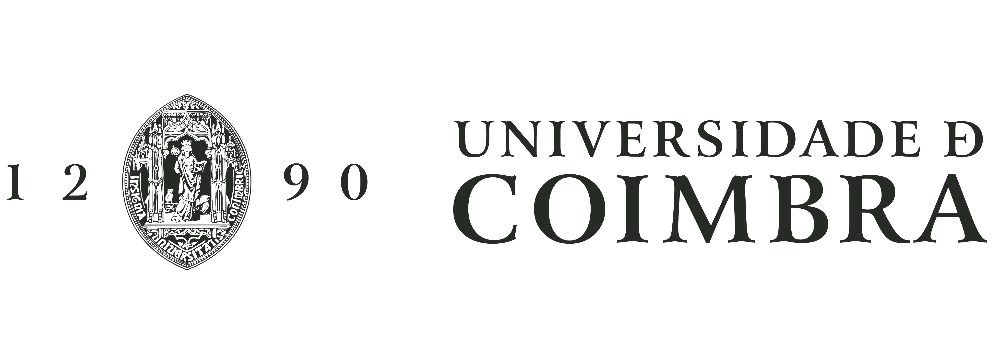
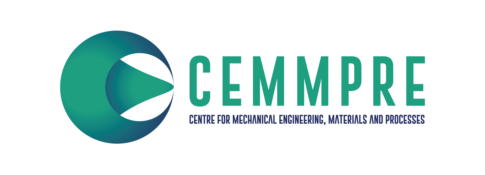
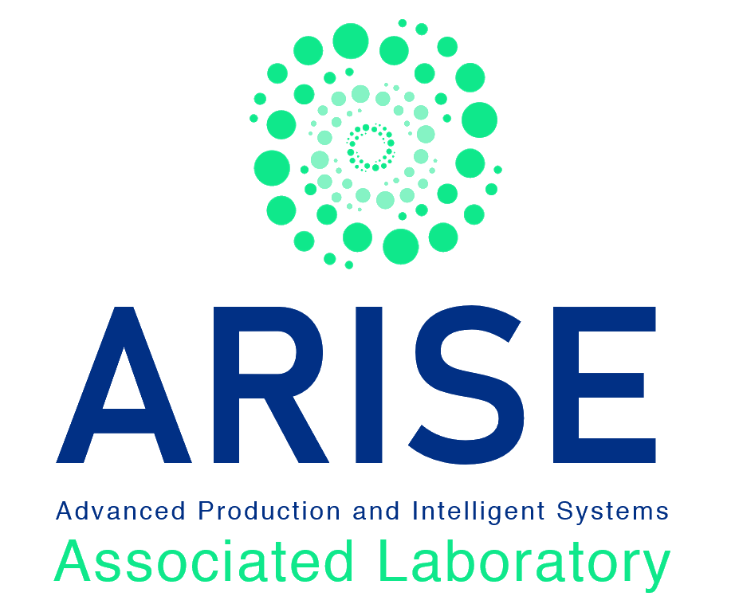

# Robotics and AI - University of Coimbra

RAI is a research laboratory from the University of Coimbra, which is part of the CEMMPRE (Center for Mechanical Engineering, Materials and Processes) R&D unit. 
Therefore, it is also a member of the associated laboratory ARISE - Advanced Production and Intelligent Systems.

It conducts interdisciplinary research within various thematic lines, encompassing both fundamental and applied research. The key thematic lines are the following:
- Collaborative Robotics
- Human-Robot Interaction
- Artificial Intelligence
- Soft Robotics
- Systems Interoperability
- Advanced Manufacturing Systems

The laboratory has been involved in research for collaborative robotics in industry, namely human-robot interaction, gesture recognition, robot task managing, collision avoidance, robot dynamics, physical interaction, 
wearables, sensor fusion, among others. 
It has also focused in advanced industrial robot applications related with object classification from RGB-B, CAD-based robotics, off-line programming, hybrid force/motion control and robotic friction stir welding.

  
  
  

